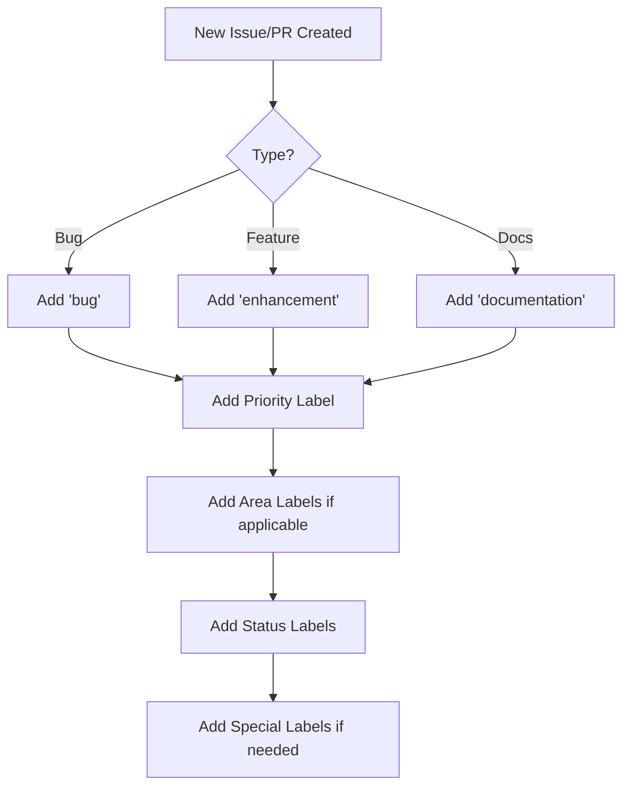

# Label Reference Guide

This document describes all the standardized labels used across repositories under the `benhigham` organization.

## 📋 Table of Contents

- [Label Reference Guide](#label-reference-guide)
  - [📋 Table of Contents](#-table-of-contents)
  - [Type Labels](#type-labels)
  - [Priority Labels](#priority-labels)
  - [Status Labels](#status-labels)
  - [Size Labels](#size-labels)
  - [Area Labels](#area-labels)
  - [Dependency Labels](#dependency-labels)
  - [Special Labels](#special-labels)
  - [Triage Labels](#triage-labels)
  - [How to Use Labels](#how-to-use-labels)
    - [For Issues](#for-issues)
    - [For Pull Requests](#for-pull-requests)
    - [Labeling Workflow](#labeling-workflow)
  - [Syncing Labels](#syncing-labels)
    - [To This Repository](#to-this-repository)
    - [To Other Repositories](#to-other-repositories)
      - [Method 1: Using github-label-sync CLI](#method-1-using-github-label-sync-cli)
      - [Method 2: Using GitHub Actions](#method-2-using-github-actions)
      - [Method 3: Manual via GitHub CLI](#method-3-manual-via-github-cli)
  - [Best Practices](#best-practices)
  - [Questions?](#questions)

---

## Type Labels

These labels categorize the **type** of work being done.

| Label | Color | Description | When to Use |
|-------|-------|-------------|-------------|
| `bug` |  `#d73a4a` | Something isn't working | Use for issues reporting bugs or PRs fixing bugs |
| `enhancement` |  `#a2eeef` | New feature or request | Use for feature requests or PRs adding new features |
| `documentation` |  `#0075ca` | Improvements or additions to documentation | Use for documentation updates, fixes, or additions |
| `refactoring` |  `#fbca04` | Code refactoring without changing functionality | Use when restructuring code without changing behavior |
| `performance` |  `#ff6b6b` | Performance improvements | Use for optimizations and performance enhancements |
| `testing` |  `#1d76db` | Adding or updating tests | Use when adding new tests or improving test coverage |

---

## Priority Labels

These labels indicate the **urgency** or **importance** of an issue or PR.

| Label | Color | Description | When to Use |
|-------|-------|-------------|-------------|
| `priority: critical` |  `#b60205` | Critical priority - needs immediate attention | Production issues, security vulnerabilities, complete blockers |
| `priority: high` |  `#d93f0b` | High priority | Important features, significant bugs affecting many users |
| `priority: medium` |  `#fbca04` | Medium priority | Standard features and bug fixes |
| `priority: low` |  `#0e8a16` | Low priority | Nice-to-have features, minor improvements |

---

## Status Labels

These labels track the **current state** of an issue or PR.

| Label | Color | Description | When to Use |
|-------|-------|-------------|-------------|
| `status: blocked` |  `#d73a4a` | Blocked by another issue or external dependency | Cannot proceed until blocker is resolved |
| `status: in progress` |  `#fbca04` | Currently being worked on | Someone is actively working on this |
| `status: needs review` |  `#0e8a16` | Needs code review | PR is ready for review |
| `status: needs testing` |  `#1d76db` | Needs testing before merge | Code is written but needs QA/testing |
| `status: ready` |  `#0e8a16` | Ready to be worked on | Issue is well-defined and ready for implementation |

---

## Size Labels

These labels indicate the **size/complexity** of a PR based on lines changed. These are typically auto-assigned by the PR Size Labeler workflow.

| Label | Color | Lines Changed | Description |
|-------|-------|---------------|-------------|
| `size: xs` |  `#3cbf00` | 1-10 | Trivial changes, typo fixes |
| `size: s` |  `#5d9801` | 11-50 | Small changes, minor bug fixes |
| `size: m` |  `#7f7203` | 51-200 | Medium-sized feature or refactor |
| `size: l` |  `#a14c05` | 201-500 | Large feature or significant refactor |
| `size: xl` |  `#c32607` | 501-1000 | Very large changes |
| `size: xxl` |  `#e50009` | 1000+ | Extremely large - consider splitting |

**Note:** PRs labeled `size: xl` or `size: xxl` should ideally be broken down into smaller, more reviewable chunks.

---

## Area Labels

These labels categorize which **part of the codebase** is affected.

| Label | Color | Description | When to Use |
|-------|-------|-------------|-------------|
| `area: ci/cd` |  `#f9d0c4` | Related to CI/CD pipelines | Changes to GitHub Actions, build processes, deployment |
| `area: security` |  `#ee0701` | Related to security | Security fixes, vulnerability patches, security features |
| `area: api` |  `#c5def5` | Related to API | API endpoints, API documentation, API contracts |
| `area: ui` |  `#bfdadc` | Related to user interface | UI components, styling, user experience |

---

## Dependency Labels

These labels indicate **dependency-related** changes.

| Label | Color | Description | When to Use |
|-------|-------|-------------|-------------|
| `dependencies` |  `#0366d6` | Pull requests that update a dependency file | Any dependency updates |
| `npm` |  `#e99695` | npm dependency updates | Specifically for npm package updates |
| `github-actions` |  `#000000` | GitHub Actions workflow updates | Updates to GitHub Actions versions |
| `docker` |  `#0db7ed` | Docker/container dependency updates | Updates to Docker images or container dependencies |
| `terraform` |  `#844fba` | Terraform dependency updates | Updates to Terraform providers or modules |
| `devcontainers` |  `#2496ed` | Development container dependency updates | Updates to devcontainer features or images |
| `git-submodules` |  `#fbca04` | Git submodule updates | Updates to Git submodule references |
| `go` |  `#00add8` | Go module dependency updates | Updates to Go module dependencies |

---

## Special Labels

These labels mark **special characteristics** of an issue or PR.

| Label | Color | Description | When to Use |
|-------|-------|-------------|-------------|
| `breaking change` |  `#d73a4a` | Introduces breaking changes | Changes that break backward compatibility |
| `backport` |  `#c5def5` | Should be backported to a previous version | Fixes that need to be applied to older release branches |
| `chore` |  `#fef2c0` | Maintenance tasks | Routine maintenance, dependency updates, tooling |

---

## Triage Labels

These labels help with **issue management** and **community engagement**.

| Label | Color | Description | When to Use |
|-------|-------|-------------|-------------|
| `triage` |  `#ededed` | Needs triage and investigation | New issues that need review and categorization |
| `duplicate` |  `#cfd3d7` | This issue or pull request already exists | Duplicate of another issue |
| `invalid` |  `#e4e669` | This doesn't seem right | Not a valid issue or out of scope |
| `wontfix` |  `#ffffff` | This will not be worked on | Intentionally not fixing this |
| `good first issue` |  `#7057ff` | Good for newcomers | Suitable for first-time contributors |
| `help wanted` |  `#008672` | Extra attention is needed | Looking for community help on this |

---

## How to Use Labels

### For Issues

1. **Always start with a type label**: Choose from `bug`, `enhancement`, `documentation`, etc.
2. **Add a priority label**: Indicate urgency with `priority: critical`, `priority: high`, etc.
3. **Add status as work progresses**: Use `status: ready`, `status: in progress`, etc.
4. **Add area labels if relevant**: Tag which part of the codebase is affected
5. **Add triage labels if needed**: Use `good first issue`, `help wanted`, etc.

**Example combinations:**

- `bug` + `priority: critical` + `area: security` = Critical security bug
- `enhancement` + `priority: low` + `good first issue` = Nice-to-have feature, good for beginners
- `documentation` + `priority: medium` + `status: ready` = Documentation task ready to be worked on

### For Pull Requests

1. **Type labels are inherited from the issue** (if linked)
2. **Size labels are auto-assigned** by the PR Size Labeler workflow
3. **Add status labels**: Use `status: needs review`, `status: needs testing`, etc.
4. **Add special labels if needed**: `breaking change`, `dependencies`, etc.

**Example combinations:**

- `bug` + `size: s` + `status: needs review` = Small bug fix awaiting review
- `enhancement` + `size: xl` + `breaking change` = Large feature with breaking changes
- `dependencies` + `npm` + `size: xs` = Small npm dependency update

### Labeling Workflow



---

## Syncing Labels

### To This Repository

Labels are automatically synced to this repository when `.github/labels.yml` is updated via the [Sync Labels workflow](.github/workflows/sync-labels.yml).

### To Other Repositories

You can sync these labels to any other repository using one of these methods:

#### Method 1: Using github-label-sync CLI

```bash
# Install globally
npm install -g github-label-sync

# Sync to a repository
github-label-sync --access-token $(gh auth token) \
  --labels .github/labels.yml \
  benhigham/your-repo-name
```

#### Method 2: Using GitHub Actions

Create a workflow in your target repository:

```yaml
# .github/workflows/sync-labels.yml
name: Sync Labels

on:
  schedule:
    - cron: '0 0 * * 0' # Weekly
  workflow_dispatch:

jobs:
  sync:
    runs-on: ubuntu-latest
    steps:
      - name: Checkout labels config
        uses: actions/checkout@v4
        with:
          repository: benhigham/.github
          path: .github-templates

      - name: Sync labels
        uses: micnncim/action-label-syncer@v1
        env:
          GITHUB_TOKEN: ${{ secrets.GITHUB_TOKEN }}
        with:
          manifest: .github-templates/.github/labels.yml
```

#### Method 3: Manual via GitHub CLI

```bash
# For each label, create it
gh label create "priority: critical" \
  --repo benhigham/your-repo \
  --color "b60205" \
  --description "Critical priority - needs immediate attention"
```

---

## Best Practices

1. **Be consistent**: Use the same labels across all repositories for easier filtering and searching
2. **Don't over-label**: 3-5 labels per issue/PR is usually sufficient
3. **Update labels as work progresses**: Keep status labels current
4. **Use size labels for scoping**: If a PR gets `size: xl` or larger, consider breaking it down
5. **Prioritize appropriately**: Not everything is `priority: critical`
6. **Auto-label when possible**: Use GitHub Actions to automatically apply labels based on patterns

---

## Questions?

If you have questions about labeling or want to suggest new labels, please open an issue!
